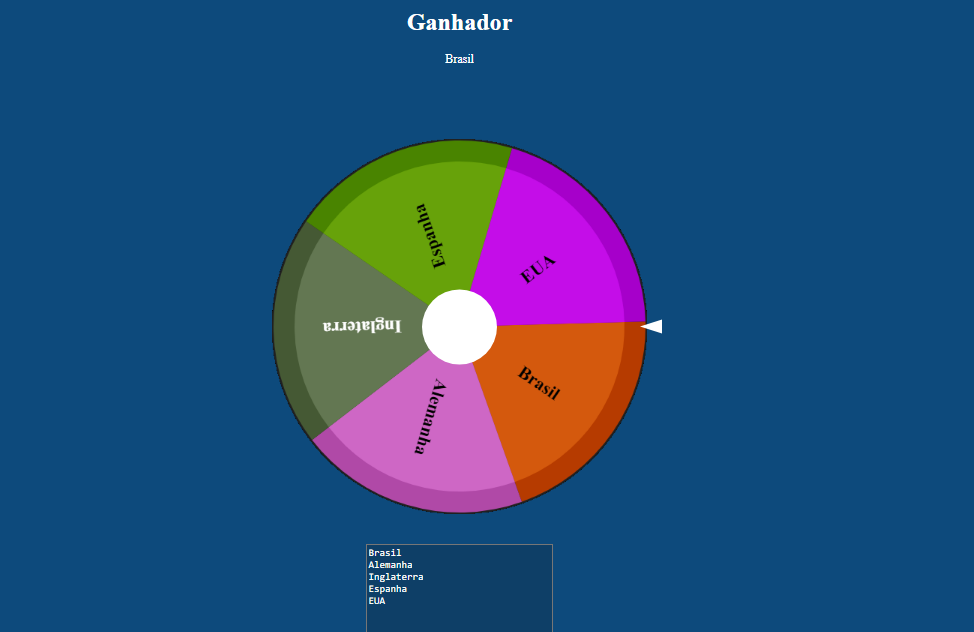

# RODA DA SORTE
👨‍🏫O USUÁRIO INSERE UMA LISTA DE ITENS EM UMA ÁREA DE TEXTO, E AO GIRAR A RODA, UM DOS ITENS É SELECIONADO ALEATORIAMENTE COMO VENCEDOR.

  

## DESCRIÇÃO:
Este projeto é uma "roda da sorte" interativa, onde o usuário insere uma lista de itens (por exemplo, nomes) em uma área de texto, e ao girar a roda, um dos itens é selecionado aleatoriamente como vencedor. A roleta é desenhada em um elemento `canvas`, com cada item representado em uma fatia colorida da roleta. A rotação é animada até parar em um vencedor, que é exibido na tela.

## COMO USAR?
1. **Insira os Itens**:  
   - No campo de texto que aparece abaixo da roleta, insira os itens que deseja sortear, separados por linha. Cada linha será uma fatia na roleta.

2. **Clique no Centro da Roleta**:  
   - Após inserir os itens, clique no círculo central da roleta (onde está o triângulo) para iniciar o giro. A roleta começará a girar e gradualmente diminuirá a velocidade até parar em um dos itens.

3. **Aguarde o Resultado**:  
   - Após a roleta parar, o item sorteado será exibido no topo da página, dentro do campo onde está escrito "GANHADOR".

4. **Atualize a Roleta (Opcional)**:  
   - Se quiser alterar os itens ou ajustar a roleta, basta modificar o conteúdo do campo de texto e a roleta será redesenhada automaticamente na próxima vez que for girada.

## NÃO SABE?
- Entendemos que para manipular arquivos em `HTML`, `CSS` e outras linguagens relacionadas, é necessário possuir conhecimento nessas áreas. Para auxiliar nesse aprendizado, oferecemos cursos gratuitos disponíveis:
* [CURSO DE HTML E CSS](https://github.com/VILHALVA/CURSO-DE-HTML-E-CSS)
* [CURSO DE JAVASCRIPT](https://github.com/VILHALVA/CURSO-DE-JAVASCRIPT)
* [CURSO DE CANVAS](https://github.com/VILHALVA/CURSO-DE-CANVAS)
* [CONFIRA MAIS CURSOS](https://github.com/VILHALVA?tab=repositories&q=+topic:CURSO)

## CREDITOS:
- [PROJETO CRIADO PELO "PedroFSampaio"](https://github.com/PedroFSampaio/Roleta_de_Sorteio)
- [PROJETO EDITADO PELO VILHALVA](https://github.com/VILHALVA)

